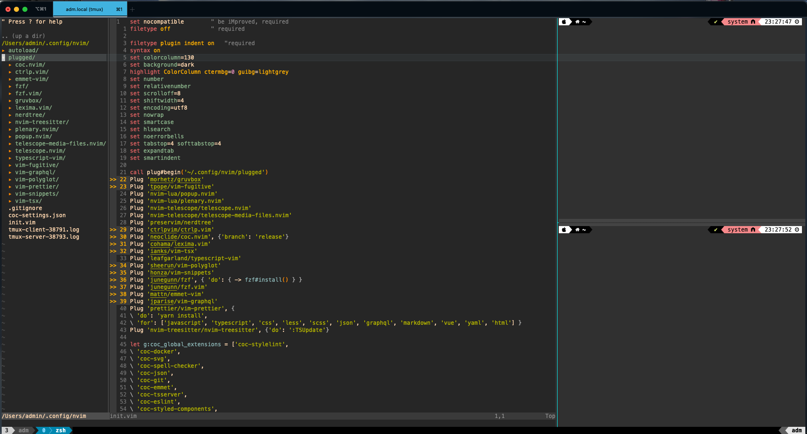

## Contents

- vim (NeoVim) config
- tmux config
- git config
- fish config
- Zsh config

## Useful links

- [Powerlevel10k theme for ZSH](https://github.com/romkatv/powerlevel10k)
- [vim-plug](https://github.com/junegunn/vim-plug) - A minimalist Vim plugin manager
- [nvim-lspconfig](https://github.com/neovim/nvim-lspconfig) - A collection of configurations for Neovim's built-in LSP
- [nvim-treesitter](https://github.com/nvim-treesitter/nvim-treesitter) - [Treesitter](https://github.com/tree-sitter/tree-sitter) configurations and abstraction layer for Neovim
- [nvim-cmp](https://github.com/hrsh7th/nvim-cmp) - A completion plugin for neovim coded in Lua
- [lspsaga.nvim](https://github.com/tami5/lspsaga.nvim) - A light-weight LSP plugin based on Neovim built-in LSP with highly a performant UI
- [nvim-lsp-installer](https://github.com/williamboman/nvim-lsp-installer) - An LSP server installer
- [telescope.nvim](https://github.com/nvim-telescope/telescope.nvim) - A highly extendable fuzzy finder over lists
- [defx.nvim](https://github.com/Shougo/defx.nvim) - A file explorer
- [Homebrew](https://brew.sh/)
- [iTerm2](https://iterm2.com/)
- [oh-my-zsh](https://github.com/ohmyzsh/ohmyzsh)
- [Vim Cheat Sheet](https://vim.rtorr.com/)
- [Trending vim color schemes](https://vimcolorschemes.com/)

